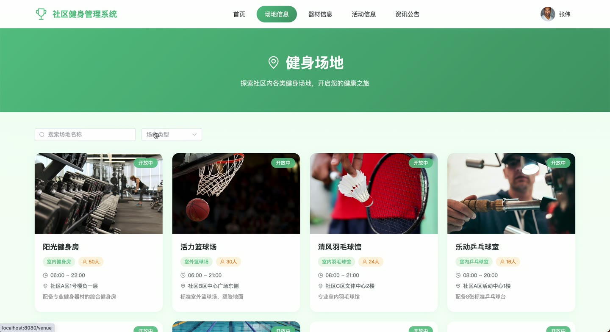
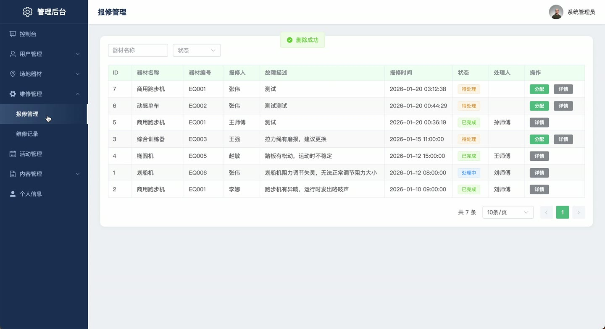
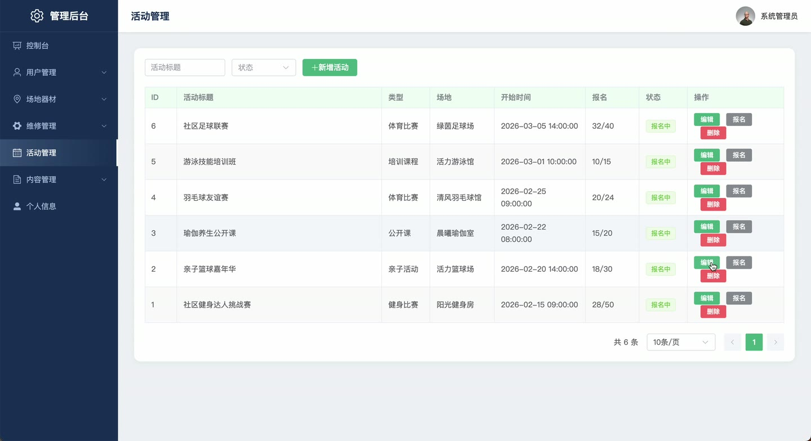
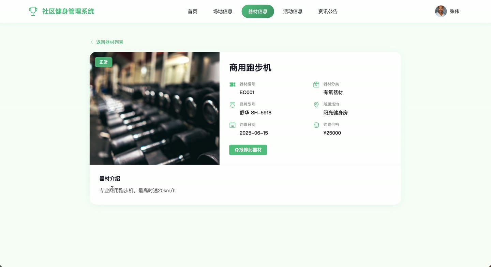

# (附文档)Springboot3+Vue3+MySQL 社区健身管理系统

**技术栈**：Springboot3、Vue3、MySQL

### 系统简介

社区健身管理系统是一套基于 Spring Boot 3 + Vue 3 前后端分离架构的综合性管理平台，涵盖用户端、管理员端与维修员端三大角色。系统实现了场地与器材管理、活动发布与报名、报修处理、在线咨询、资讯公告等核心业务，适用于社区健身中心、体育馆等场所的数字化运营管理。
 
### 核心功能
 
### 普通用户端

 
- 浏览场地列表（支持按名称/类型筛选），查看场地详情（含位置、面积、容量、开放时间、设施描述） 
- 查看器材列表（支持按名称/分类/所属场地筛选），查看器材详情（含品牌、型号、购买日期、价格、状态） 
- 浏览活动列表（支持按标题/类型/状态筛选），查看活动详情（含封面、内容、起止时间、最大参与人数、当前参与人数、报名截止时间、组织者、联系电话） 
- 报名活动（填写活动ID与用户ID，自动校验是否已报名、活动是否在报名中、名额是否已满，报名成功后活动当前参与人数+1） 
- 取消报名（将报名记录状态置为0，活动当前参与人数-1） 
- 查看我的报名记录（按用户ID分页查询，支持按活动ID/状态筛选） 
- 提交器材报修申请（选择器材、填写故障描述、上传故障图片，自动填充器材名称与编号，状态默认为待处理） 
- 查看我的报修申请列表（按用户ID分页查询，支持按器材名称/状态筛选） 
- 浏览资讯公告列表（支持按标题/类型/状态筛选，已发布资讯按置顶状态与创建时间排序） 
- 查看资讯详情（自动增加浏览次数+1） 
- 发起在线咨询（自动创建或获取与管理员之间的会话，发送消息并记录发送者类型与名称） 
- 查看咨询消息列表（按会话ID升序获取所有消息） 
- 个人中心：修改个人信息（用户名、真实姓名、手机号、邮箱、头像、性别） 
- 修改登录密码（根据用户ID更新密码字段）
 
### 管理员端

 
- 仪表盘概览：统计普通用户数、维修员数、场地数、器材数、进行中活动数、待处理报修数 
- 用户管理：分页查询用户列表（支持按用户名/真实姓名/角色筛选），新增/编辑/删除用户，启用或禁用用户（修改status字段） 
- 场地管理：分页查询场地列表（支持按名称/类型筛选），新增/编辑/删除场地（含名称、类型、位置、面积、容量、开放时间、关闭时间、图片、设施、描述） 
- 器材管理：分页查询器材列表（支持按名称/分类/所属场地筛选），新增/编辑/删除器材（含编号、名称、分类、品牌、型号、所属场地、图片、购买日期、价格、状态） 
- 活动管理：分页查询活动列表（支持按标题/类型/状态筛选），新增/编辑/删除活动（含标题、类型、封面、内容、关联场地、起止时间、最大参与人数、报名截止时间、组织者、联系电话），查看报名记录 
- 活动报名管理：分页查询报名记录（支持按活动ID/用户ID/状态筛选），为报名用户签到（将报名记录状态置为2并记录签到时间） 
- 资讯公告管理：分页查询资讯列表（支持按标题/类型/状态筛选），新增/编辑/删除资讯（含标题、类型、封面、内容、作者、置顶状态），发布/下架资讯 
- 轮播图管理：分页查询轮播图列表，新增/编辑/删除轮播图（含标题、图片、链接、排序号、状态） 
- 报修申请管理：分页查询报修申请（支持按器材名称/状态/处理人筛选），受理申请（指派维修员、填写处理结果），查看申请详情 
- 维修记录管理：分页查询维修记录（支持按器材名称/状态/维修员筛选），新增/编辑/删除维修记录（含器材、维修员、维修类型、维修零件、维修内容、费用、起止时间） 
- 在线咨询管理：查看所有咨询会话列表（按更新时间倒序），回复用户消息（发送消息并更新会话最后消息与未读数），标记会话为已读 
- 数据统计：查看器材状态分布（正常/维修中/已报废数量），报修状态统计（待处理/处理中/已完成），活动状态统计（已取消/报名中/进行中/已结束） 
- 文件管理：上传图片/文件（返回可访问URL），删除已上传文件
 
### 维修员端

 
- 查看分配给自己的报修申请列表（按处理人ID分页查询，支持按器材名称/状态筛选） 
- 受理报修申请（填写处理结果，将申请状态从待处理更新为处理中） 
- 完成维修（将申请状态更新为已完成，记录处理时间） 
- 查看自己的维修记录列表（按维修员ID分页查询，支持按器材名称/状态筛选） 
- 新增维修记录（选择器材、填写维修类型、维修零件、维修内容、费用，自动填充器材名称与编号，记录维修开始时间） 
- 完成维修记录（将记录状态置为1，记录维修结束时间） 
- 修改个人信息（真实姓名、手机号、邮箱、头像、性别） 
- 修改登录密码
 
### 技术栈

 后端框架Spring Boot 3 ORMMyBatis-Plus（含分页插件、逻辑删除） 权限角色字段（role: 1管理员/2普通用户/3维修员） 前端框架Vue 3 状态管理Vuex / Pinia（前端路由含用户/管理员/维修员端页面） 构建工具Vite 数据库MySQL（含11张业务表：sys_user, venue, equipment, activity, activity_registration, news, banner, repair_request, repair_record, chat_session, chat_message） 文件上传本地存储（按日期分目录，UUID重命名） 工具库Hutool（字符串处理、日期、UUID）、Lombok
 
### 交付内容

 
- 后端完整源码 
- 前端完整源码 
- 数据库初始化脚本 
- 万字文档

## 界面展示

---

## 获取完整源码 + 万字文档

本仓库为项目介绍页。**完整前后端源码、数据库初始化脚本、万字项目文档**，请加微信 `kangkangcode`，或访问 [codekk.top](http://codekk.top) 获取。

可作课程设计 / 毕业设计参考，支持远程部署调试。